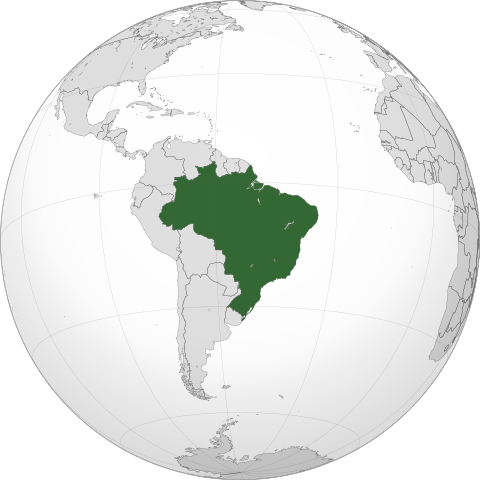
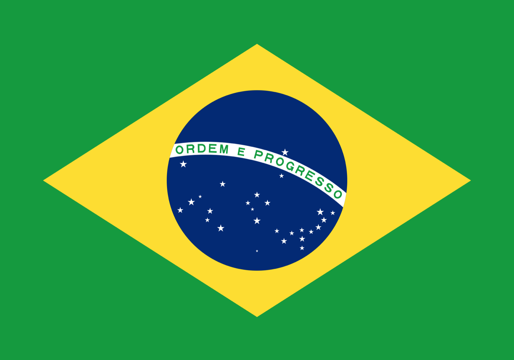
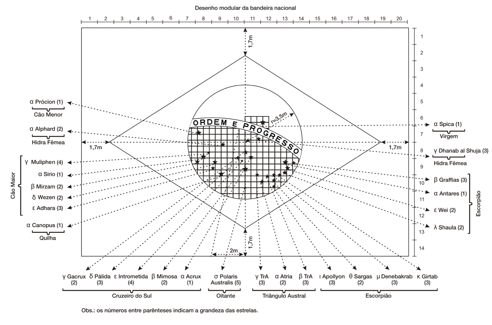

# BR_Flag_design
Design of the Brazilian flag using turtle package

  

  

## Country
For those unacquainted to the biggest country in South America, here is a quick description of its geographical, political and environmental characteristics.

> Brazil, officially the **Federative Republic of Brazil**, is the largest country in South America and in Latin America. At 8.5 million square kilometers (3,300,000 sq mi) and with over 217 million people, Brazil is the world's fifth-largest country by area and the seventh most populous. Its capital is Brasília, and its most populous city is São Paulo. The federation is composed of the union of the 26 states and the Federal District. It is the only country in the Americas to have Portuguese as an official language. It is one of the most multicultural and ethnically diverse nations, due to over a century of mass immigration from around the world, and the most populous Roman Catholic-majority country.  
Bounded by the Atlantic Ocean on the east, Brazil has a coastline of 7,491 kilometers (4,655 mi). It borders all other countries and territories in South America except Ecuador and Chile and covers roughly half of the continent's land area. Its Amazon basin includes a vast tropical forest, home to diverse wildlife, a variety of ecological systems, and extensive natural resources spanning numerous protected habitats. This unique environmental heritage positions Brazil at number one of 17 megadiverse countries, and is the subject of significant global interest, as environmental degradation through processes like deforestation has direct impacts on global issues like climate change and biodiversity loss.  
* Extracted from [BRAZIL](https://en.wikipedia.org/wiki/Brazil)

## Objective:
Reproduce the design of the Brazilian flag. All its features are recreated using the **Turtle package**.

  

### Features
According to [BRAZIL_FLAG](https://en.wikipedia.org/wiki/Flag_of_Brazil), it is based on a 20 x 14 (Length x Width) units of distance (M), translated into an aspect ratio of 10:7. The distances of vertices of the yellow diamond to the edges is 1.7M, the blue circle's radius is 3.5M and the lower and upper arch of the white stripe are 8 and 8.5M radius, respectively. Each star represent one Brazilian state plus the Federal District which in total comes to 27 stars. Their sizes vary between five different magnitudes:
* first  -> 0.3M ;
* second -> 0.25M ;
* third  -> 0.2M ;
* fourth -> 0.14M ;
* fifth -> 0.1M .

Most of the features' distances and dimensions can be seen on the image below.

  

* Extracted from [Flag features](https://en.wikipedia.org/wiki/Flag_of_Brazil#/media/File:Flag_of_Brazil_(dimensions).svg)

## Result

https://user-images.githubusercontent.com/15235685/226688704-19487841-d0f0-402c-8498-993506ca9cf2.mp4

