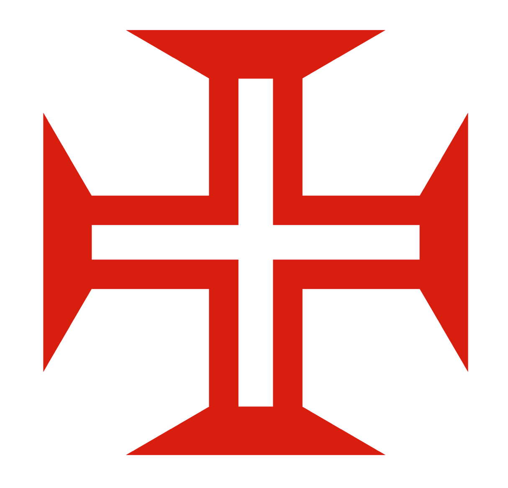

# Order of Christ Cross
The Cross of the Order of Christ (Portuguese: Cruz da Ordem de Cristo), also known as the Cross of Christ (Cruz de Cristo) or the Portuguese Cross (Cruz Portuguesa), is a cross symbol of Portugal, originating in the Portuguese Order of Christ, founded in 1319. During the time of Prince Henry the Navigator, the cross came to be associated with the Portuguese discoveries and the Portuguese Empire. The cross can be considered a variant of the cross pattée or the cross potent. [link](https://en.wikipedia.org/wiki/Order_of_Christ_Cross)

## Objective:
Reproduce the design of the Cross of the Order of Christ. All its features are recreated using the **Turtle package**.
